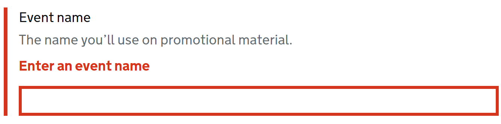

# EtTestHelpers

A gem to assist in testing employment tribunal applications or
any other application that uses GDS components.

## Installation

Add this line to your application's Gemfile:

```ruby
gem 'et_test_helpers'
```

And then execute:

    $ bundle install

Or install it yourself as:

    $ gem install et_test_helpers

## Usage

### Using The Capybara Selectors

The ethos of this gem is to always find the top level of components.  What is meant by that is better 
demonstrated in an example text field.

The source of this information is https://design-system.service.gov.uk/components/text-input/

A govuk GDS compliant text field looks like this with a hint and errors



and its HTML looks like this

```html
<div class="govuk-form-group govuk-form-group--error">
  <label class="govuk-label" for="event-name">
    Event name
  </label>
  <span id="event-name-hint" class="govuk-hint">
    The name you’ll use on promotional material.
  </span>
  <span id="event-name-error" class="govuk-error-message">
    <span class="govuk-visually-hidden">Error:</span> Enter an event name
  </span>
  <input class="govuk-input govuk-input--error" id="event-name" name="event-name" type="text" aria-describedby="event-name-hint event-name-error">
</div>
```

Using normal capybara selectors, if you were to do
```ruby
find(:fillable_field, 'Event name')
``` 

against the above HTML, it would provide you with the input element.
But, we dont want that, we want the wrapper around it - which
will be the root of the component - so the component can fetch its
input element, its label, its error messages etc..

All of the capybara selectors are prefixed with 'govuk_' and named 
hopefully sensibly.

So, to get access to the root of the above text field we would use

```ruby
find(:govuk_text_field, 'Event name')
```

or if you are doing a multi lingual test suite

```ruby
find(:govuk_text_field, :'some.i18n.key')
```

where the value will be looked up by I18n.t

or if your test suite has its own method of translation (so for example you
are separating test expectations from implementation which is good practice)

Put this somewhere that executes before any tests are run

```ruby
EtTestHelpers.configure do |c|
  c.translate = -> key { MyI18nLibrary.t(key) }
end
```

replacing MyI18nLibrary.t with whatever method you want

### Using The SitePrism Components

This gem provides site prism (https://rubygems.org/gems/site_prism) sections as 'components' so that you can do the following in your
page objects.

```ruby
  class MyPage < ::SitePrism::Page
    section :govuk_text_field, govuk_component(:text_field), :govuk_text_field, 'Text field label'
  end
```

When you create an instance of this page as normal, you can then do :-

```ruby
  my_page.govuk_text_field.label.text
```
to fetch the label text or

```ruby
  my_page.govuk_text_field.hint.text
```
to fetch the hint text or

```ruby
  my_page.govuk_text_field.input.value
```
to fetch the input value or
```ruby
  my_page.govuk_text_field.error.text
```
to fetch the error text or

```ruby
  expect(my_page.govuk_text_field.label).to have_text('Expected Label')
  expect(my_page.govuk_text_field.hint).to have_text('Expected Hint')
```
etc.. etc..

## Development

After checking out the repo, run `bin/setup` to install dependencies. Then, run `rake spec` to run the tests. You can also run `bin/console` for an interactive prompt that will allow you to experiment.

To install this gem onto your local machine, run `bundle exec rake install`. To release a new version, update the version number in `version.rb`, and then run `bundle exec rake release`, which will create a git tag for the version, push git commits and tags, and push the `.gem` file to [rubygems.org](https://rubygems.org).

## Contributing

Bug reports and pull requests are welcome on GitHub at https://github.com/[USERNAME]/et_test_helpers. This project is intended to be a safe, welcoming space for collaboration, and contributors are expected to adhere to the [code of conduct](https://github.com/[USERNAME]/et_test_helpers/blob/master/CODE_OF_CONDUCT.md).


## License

The gem is available as open source under the terms of the [MIT License](https://opensource.org/licenses/MIT).

## Code of Conduct

Everyone interacting in the EtTestHelpers project's codebases, issue trackers, chat rooms and mailing lists is expected to follow the [code of conduct](https://github.com/[USERNAME]/et_test_helpers/blob/master/CODE_OF_CONDUCT.md).
